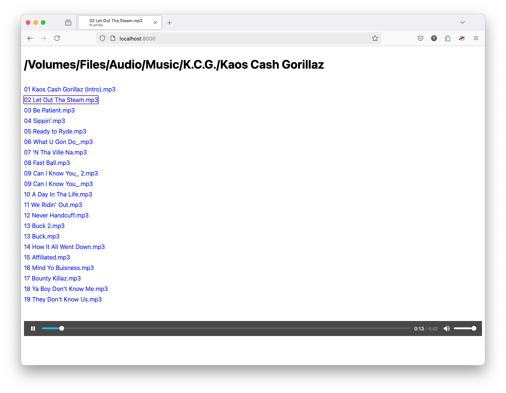

Musicplayer
===========

Essentially a directory listing with a builtin music player.

Assuming you have [Deno](https://deno.land) installed, you can just download `musicplayer`,
run `musicplayer` from your music directory, then browse to
http://localhost:8000/.

```
$ cd ~/Music/MyFavoriteArtist/BestAlbum
$ musicplayer
$ open http://localhost:8000
```

Or, just serve it straight from GitHub:

```
$ deno serve --allow-read https://raw.githubusercontent.com/taeber/musicplayer/refs/heads/main/musicplayer
```

_Copyright © 2025 Taeber Rapczak \<taeber@rapczak.com>_.
_License: [MIT](LICENSE)_.



Keyboard Controls
-----------------

```
j, ←, ↓, <Tab>         Select next track
k, →, ↑, <Shift+Tab>   Select previous track

<Enter>   Play selected track
<Space>   Play/Pause current track
```


Features
--------

Umm... the title gets updated with the current track's filename. Is that cool?

